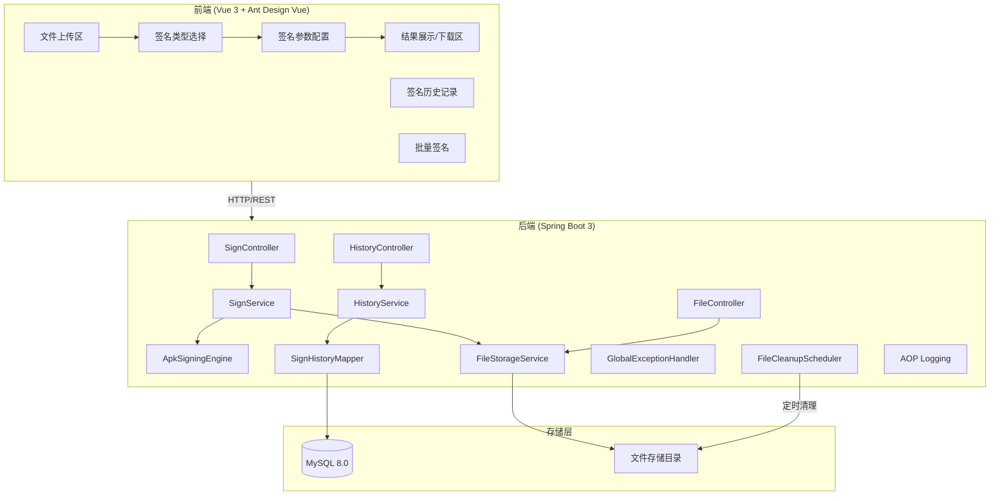

# Android APK Signing Platform - 项目设计文档

## 1. 系统架构



## 2. ER 图

```mermaid
erDiagram
    SIGN_HISTORY {
        bigint id PK "主键"
        varchar original_filename "原始文件名"
        varchar signed_filename "签名后文件名"
        varchar file_path "文件存储路径"
        varchar signed_file_path "签名文件路径"
        varchar sign_type "签名类型: DEBUG/RELEASE/V1/V2/V3"
        varchar key_alias "密钥别名"
        int validity_years "有效期(年)"
        bigint file_size "文件大小(bytes)"
        varchar status "状态: PENDING/PROCESSING/SUCCESS/FAILED"
        varchar error_message "错误信息"
        varchar download_code "下载码(用于扫码下载)"
        datetime created_at "创建时间"
        datetime updated_at "更新时间"
    end

    SIGN_CONFIG {
        bigint id PK "主键"
        varchar config_key "配置键"
        varchar config_value "配置值"
        varchar description "描述"
        datetime created_at "创建时间"
    end
```

## 3. 接口清单

### SignController (`/api/sign`)
| Method | Path | Description |
|--------|------|-------------|
| POST | `/api/sign/upload` | 上传APK文件 |
| POST | `/api/sign/execute` | 执行签名操作 |
| POST | `/api/sign/batch` | 批量签名 |
| GET | `/api/sign/status/{id}` | 查询签名状态 |

### FileController (`/api/file`)
| Method | Path | Description |
|--------|------|-------------|
| GET | `/api/file/download/{id}` | 下载签名后的APK |
| GET | `/api/file/download/code/{code}` | 通过下载码下载 |
| GET | `/api/file/qrcode/{id}` | 获取下载二维码 |

### HistoryController (`/api/history`)
| Method | Path | Description |
|--------|------|-------------|
| GET | `/api/history/list` | 获取签名历史列表 |
| DELETE | `/api/history/{id}` | 删除历史记录 |
| DELETE | `/api/history/batch` | 批量删除历史 |

## 4. UI/UX 规范

- 主色调: `#1677ff` (Ant Design Blue)
- 辅助色: `#52c41a` (成功绿), `#ff4d4f` (错误红), `#faad14` (警告黄)
- 背景色: `#f0f2f5` (页面背景), `#ffffff` (卡片背景)
- 字体: `-apple-system, BlinkMacSystemFont, 'Segoe UI', Roboto, sans-serif`
- 卡片圆角: `8px`
- 间距系统: `8px / 16px / 24px / 32px`
- 阴影: `0 2px 8px rgba(0, 0, 0, 0.08)`
